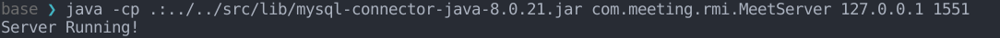

## 描述
分布式会议管理项目(学校作业)
能够实现用户注册, 用户登录, 添加,删除会议等功能

## 环境
maven
MySQL

## 编译
在有pom.xml的目录下使用命令```mvn compile```

## 启动服务器
```
cd  ./meeting_rmi/target/classes
java -cp .:../../src/lib/mysql-connector-java-8.0.21.jar com.meeting.rmi.MeetServer <ip> <port>
```
example: 
```java -cp .:../../src/lib/mysql-connector-java-8.0.21.jar com.meeting.rmi.MeetServer 127.0.0.1 1551 ```
显示"Server Running!"


## 启动客户端
```
cd  ./meeting_rmi/target/classes
java com.meeting.rmi.MeetClient <port> <ip> <command> <params>
```
help命令显示帮助信息

help: 
```java com.meeting.rmi.MeetClient 127.0.0.1 1551 help```
在login或register后自动进入交互, 输入help出现帮助登录后的信息, 根据提示信息运行

ps: 注意setting.xml需要放在./meeting_rmi/target/classes/com/meeting/rmi/database下, 同时更改其中的MySQL用户名<USER>和密码<PASSWORD>,以及连接<DB_URL>
